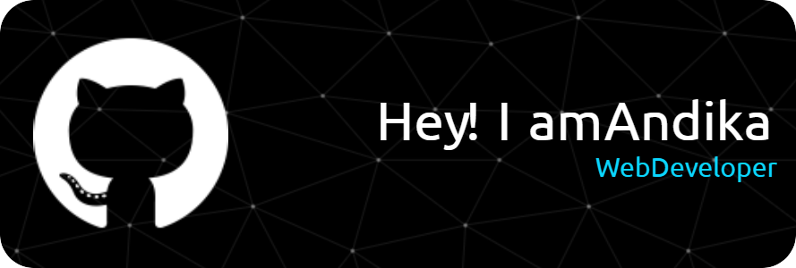

<h1 align="center">Hi 👋, I'm Andika</h1>
<h3 align="center">I am a web developer from Indonesia</h3>

  

- 🌱 I’m currently learning **Laravel and React Js**

- 📫 How to reach me **andika0106dwiki@gmail.com**

- ⚡ Fun fact **I am funny**

<h3 align="left">Connect with me:</h3>

<h3 align="left">Languages and Tools:</h3>

                  

  

